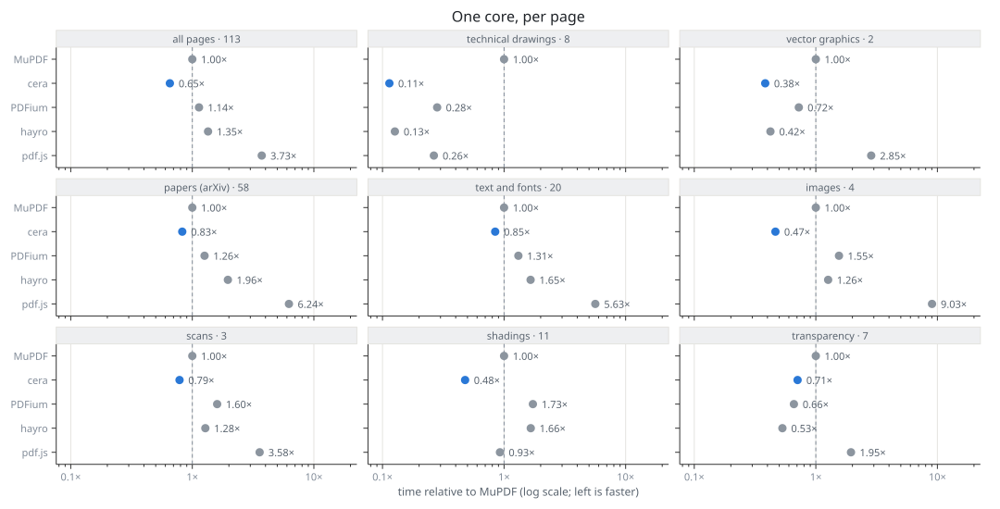
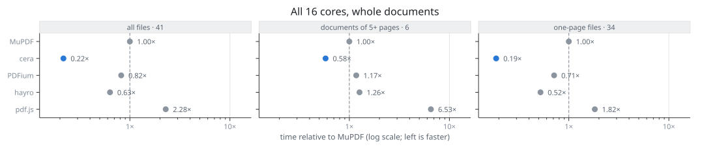
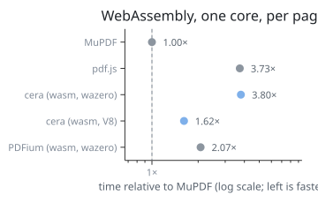

# Performance

How fast cera renders against other PDF engines, measured by
[`bench/`](../bench) on the pinned corpus (see [Development](development.md#corpora)).

**Every number here is a ratio, never a time.** Times depend on the
processor and on what else the machine is doing; the ratio of two engines
measured side by side does much less. `bench` measures times, turns them
into ratios straight away and writes none out. Absolute values are given
only for what does not depend on speed: allocations, memory, failed pages.

Below, **1.00× is MuPDF**; 0.50× takes half its time, 2.00× twice. 150
dpi, the pinned corpus of 41 files and 113 pages; machine and versions at
the end. The data behind every table is in [`performance/`](performance):
ratios per page and per file, no times.

## One core, per page

<picture>
  <source media="(prefers-color-scheme: dark)" srcset="performance/single-dark.svg">
  
</picture>

| pages | all<br>113 | drawings¹<br>8 | papers<br>58 | text, fonts<br>20 | shadings<br>11 | transparency<br>7 | images<br>4 | scans<br>3 | vector<br>2 |
|---|---|---|---|---|---|---|---|---|---|
| MuPDF | 1.00× | 1.00× | 1.00× | 1.00× | 1.00× | 1.00× | 1.00× | 1.00× | 1.00× |
| **cera** | **0.65×** | **0.11×** | **0.83×** | **0.85×** | **0.48×** | **0.71×** | **0.47×** | **0.79×** | **0.38×** |
| PDFium | 1.14× | 0.28× | 1.26× | 1.31× | 1.73× | 0.66× | 1.55× | 1.60× | 0.72× |
| hayro | 1.35× | 0.13× | 1.96× | 1.65× | 1.66× | 0.53× | 1.26× | 1.28× | 0.42× |
| pdf.js | 3.73× | 0.26× | 6.24× | 5.63× | 0.93× | 1.95× | 9.03× | 3.58× | 2.85× |

¹ The drawings are cera's own synthetic A3 scenes (`cmd/corpus scenes`):
hatches, short strokes and contours of thousands of paths. MuPDF is unusually
slow on them (seconds per page; go-fitz, MuPDF linked statically, confirms
it), so this column says more about MuPDF's stroker than about cera. Read
the papers and text columns for everyday documents.

Where cera loses: on transparency hayro and PDFium are ahead of it. On
scans (CCITT and JBIG2 images, 3 pages) it took 1.4× MuPDF's time until
1-bit images got their own sampling (#71) and large pages that draw little
were filled past the caches (#81). A page's ratio varies between paired
runs by 9 % (median interquartile range); for how far the means hold, see [How stable the ratios are](#how-stable-the-ratios-are).

## All cores, whole documents

<picture>
  <source media="(prefers-color-scheme: dark)" srcset="performance/multi-dark.svg">
  
</picture>

| 16 cores | all files (41) | documents of 5+ pages (6) | one-page files (34) |
|---|---|---|---|
| MuPDF | 1.00× | 1.00× | 1.00× |
| **cera** | **0.21×** | **0.56×** | **0.18×** |
| PDFium | 0.81× | 1.15× | 0.71× |
| hayro | 0.64× | 1.23× | 0.53× |
| pdf.js | 2.24× | 6.60× | 1.77× |

Each engine's own gain over one core, measured in pairs: every run of a
document on all cores next to the same run on one core (one thread, or
one process), the two taking turns at going first:

| | documents of 5+ pages | one-page files | how |
|---|---|---|---|
| cera | 4.0× | 1.7× | its own threads: pages concurrently, bands of a page |
| MuPDF | 2.7× | 1.0× | one process per core |
| PDFium | 3.2× | 1.0× | one process per core |
| hayro | 3.8× | 1.0× | one process per core |
| pdf.js | 1.9× | 1.0× | one process per core |

On a single page only cera uses more than one core, hence its lead on
one-page files. The engines with one process per core come out at 1.0×
there, as they must. Until #85 the gain compared the one-core pass with
the all-cores runs taken minutes apart. On pages of well under a
millisecond that measured noise: MuPDF "gained" 0.37× on one file.

On documents of several pages, cera's gain rose from 1.9× (2026-10-06,
measured the old way) through these changes (#63):
- cheap pages are drawn in one pass, not by many workers (#78);
- the background is filled band by band while the band is in the cache,
  so pages drawn at once wait less on memory (#79);
- every page is drawn with the default workers, all cores, rather than its
  share of them, so the pages left take the cores of those done (#86).

That puts cera's gain level with hayro's, the best of the engines with one
process per core; between full runs these gains move by about 10 %
(hayro 4.0× in the run before, MuPDF 3.0×). On 16 cores, every engine is
far from 16×: the documents are of 5 to 22 pages, and their slowest page
bounds the whole. A page drawn while the others are drawn takes 2 to 4
times as long as alone, the hardware's share being two threads per core,
a lower clock on all cores and a shared memory bus. cera run as one
process per core, as the others are, gained less than with its own
threads.

Single one-page files still vary between full runs:
- cera's gain on its slowest file was 0.55× in this run, while alone,
  repeated, the same files measure 1.0–1.4×;
- the one-process engines drop to 0.72–0.88× on some files too, where 1.0×
  is the truth.

The goal of #63, no page slower on all cores than on one, is therefore met
in repeated measurements of the files alone, but cannot be read off a
single full run.

## First page

Opening a file and drawing page 1 in a fresh process, the wait before a
viewer shows something (one sample per file, noisier):

| | all files | drawings | papers | text, fonts |
|---|---|---|---|---|
| MuPDF | 1.00× | 1.00× | 1.00× | 1.00× |
| **cera** | **0.38×** | **0.13×** | **0.93×** | **0.30×** |
| PDFium | 0.67× | 0.29× | 0.90× | 0.75× |
| hayro | 0.38× | 0.13× | 0.79× | 0.30× |
| pdf.js | 6.61× | 0.67× | 10.74× | 16.64× |

pdf.js pays here for compiling its JavaScript before its first page. On the
first page of the papers cera is about as fast as MuPDF; with one sample
per file that column moves a lot between runs (1.19× in the run before).

## WebAssembly

<picture>
  <source media="(prefers-color-scheme: dark)" srcset="performance/wasm-dark.svg">
  
</picture>

One core, per page, against native MuPDF:

| | all pages |
|---|---|
| MuPDF, native | 1.00× |
| **cera, WebAssembly (`wasip1` on V8, Node's WASI)** | **1.64×** |
| PDFium, WebAssembly (go-pdfium on wazero) | 2.05× |
| pdf.js (JavaScript, Node) | 3.73× |
| cera, WebAssembly (`wasip1` on wazero) | 3.71× |

The same `ceraworker.wasm` runs on two runtimes:
- **V8**, the engine of Chrome and Node, through Node's WASI, single-threaded
  like the pdf.js worker. This is what a browser gives.
- **wazero**, whose compiler does not optimize. It is the runtime go-pdfium
  runs PDFium on.

cera takes 2.5× its native time on V8 and 5.7× on wazero. PDFium's module
needs Emscripten's imports, so it is measured on wazero only. PDFium on wazero
against cera on V8 is therefore not a comparison of equals, and cera on
wazero (3.71×) against PDFium on wazero (2.05×) is.

Builtin `min` and `max` on floats compile to runtime calls in WebAssembly
([golang/go#82073](https://github.com/golang/go/issues/82073)). The path
boxes of the display list took them by comparisons instead, which made cera
about 30 % faster under V8 (#77, [#65](https://github.com/timzifer/cera/issues/65)).

On the first page in a fresh process, cera on V8 is slower than on wazero
(4.17× against 2.16× MuPDF): V8 compiles the module in every new process,
and wazero takes it from its compilation cache.

## Memory

Peak resident memory of an engine's process per file (median over files,
and the largest), the interpreter included for pdf.js:

| | median | largest |
|---|---|---|
| hayro | 15 MB | 8.6 GB² |
| **cera** | **38 MB** | **148 MB** |
| MuPDF | 60 MB | 113 MB |
| PDFium | 91 MB | 323 MB |
| pdf.js | 149 MB | 994 MB |

² `tiling-pattern-box.pdf`.

cera allocates once per page (median; 90th percentile 86, most 1 713),
48 bytes, the bitmap not counted, counted as `cmd/corpus run` counts: the
page drawn, released, and drawn again from scratch. The count depends a
little on what the caches and pools hold: against `cmd/corpus run` it agrees
within 10 % or 5 allocations on 103 of 113 pages. Drawing a page again from
cera's display list (another tile, a scrolled viewport) takes 69 % of the
first render.

## Command line, PDF to PNG

The plain question "how long does converting this PDF to PNGs take?": each
tool's wall clock from start to exit, PNG encoding included, against
`mutool draw`.

What each tool does with its PNGs matters here as much as drawing, so cera
appears three times: the way `cmd/cera` writes PNGs by default, and its
two other `-png` modes. All three compress at the fastest level
(`BestSpeed`).

- `cmd/cera` (`-png encode`, the default): after drawing a page, calamus
  compresses it in bands of rows on all cores.
- `-png stream`: calamus compresses each band as soon as it is drawn
  (`RenderOptions.Band`), while the other bands are still being drawn.
- `-png stdlib`: Go's `image/png` after drawing, on one core.

The other tools write PNGs as they always do, at their default levels.

| | all files | drawings | papers | text, fonts | scans |
|---|---|---|---|---|---|
| **one core** | | | | | |
| MuPDF (`mutool draw`) | 1.00× | 1.00× | 1.00× | 1.00× | 1.00× |
| **cera** (`cmd/cera`) | **0.55×** | **0.25×** | **0.72×** | **0.69×** | **0.56×** |
| cera, `-png stream` | 0.55× | 0.24× | 0.71× | 0.70× | 0.56× |
| cera, `-png stdlib` | 0.62× | 0.28× | 0.81× | 0.80× | 0.64× |
| Poppler (`pdftoppm`) | 2.64× | 1.09× | 5.87× | 3.15× | 2.48× |
| Ghostscript | 3.88× | 1.34× | 2.56× | 4.95× | 4.37× |
| **16 cores** | | | | | |
| MuPDF (`mutool draw -T 16 -B 256`) | 1.00× | 1.00× | 1.00× | 1.00× | 1.00× |
| **cera** | **0.47×** | **0.27×** | **0.33×** | **0.62×** | **0.55×** |
| cera, `-png stream` | 0.48× | 0.28× | 0.38× | 0.61× | 0.53× |
| cera, `-png stdlib` | 0.73× | 0.65× | 0.81× | 0.80× | 0.67× |
| Poppler (no threads) | 3.32× | 3.10× | 6.41× | 3.11× | 2.57× |
| Ghostscript (`-dNumRenderingThreads=16`) | 4.89× | 3.75× | 2.70× | 5.07× | 4.44× |

**The files are not the same size.** Bytes written against `mutool draw`:

| | all files | drawings | papers | text, fonts | scans |
|---|---|---|---|---|---|
| cera (all three modes) | 1.27× | 1.17× | 1.25× | 1.75× | 1.77× |
| Poppler | 0.67× | 0.44× | 1.15× | 0.95× | 0.76× |
| Ghostscript | 0.61× | 0.61× | 0.55× | 0.61× | 0.52× |

cera's PNGs are about a quarter larger than MuPDF's, up to 1.8× on text
and scans. That comes from `BestSpeed`, not from the bands: `image/png`
at the same level writes the same sizes within 1 %. Part of cera's lead
here is therefore spending less effort on compression than the other
tools do. A comparison at equal file size is not made yet.

Two runs of the whole comparison gave the same ratios within 0.02, except
for papers on 16 cores, where `-png stream` was 0.38× in both runs
against 0.33× for the default.

Streaming gains nothing measurable:

- On one core nothing can overlap.
- On 16 cores calamus already compresses a page in bands on all cores
  once it is drawn.
- Streamed, a band is compressed on the goroutine that drew it, joined
  with its neighbours to at least 256 rows, while other bands are still
  drawn. On papers this is slower than compressing the finished page on
  all cores.

`-png stream` stays as an option, and the default writes as before.

With `image/png`, encoding was 61–88 % of the command's time (#67).
calamus made the command 1.1× faster on one core and 1.6× on 16. Poppler
and Ghostscript, unchanged, measured the same as before within 2 %.

On the three scan pages cera's library is faster than MuPDF's (0.70–0.96×,
#64). On the command line start-up and encoding add to
both.

## Accuracy alongside

Share of the inked area whose content differs from the consensus of the
other engines (`accuracy/reference`, same corpus): MuPDF 0.33 %, cera
1.10 %, PDFium 5.17 %. hayro and pdf.js are not in that comparison yet.
No engine drew less than half the median engine's ink on any page.

## How stable the ratios are

On 2026-10-06, the 47 pages of the pdf.js files were measured three times with cera,
MuPDF, PDFium and hayro: twice on a quiet machine (once inside the full run
above, once alone) and once with 8 of the 16 hardware threads kept busy by
another program:

| relative to MuPDF | quiet | quiet, again | 8 threads busy |
|---|---|---|---|
| PDFium | 1.26× | 1.21× | 1.21× |
| hayro | 1.23× | 1.22× | 1.21× |
| cera | 0.72× | 0.76× | 0.84× |

Between the native engines the ratios hold within a few per cent, under load
too: taking turns works. cera's ratio does not hold as well: it differs by
6 % between the two quiet runs and grows by 10 % under load, so cera loses
more than the C and Rust engines when other programs share the processor
(caches, memory bandwidth or its garbage collector; not yet examined). The
tables above come from a quiet machine; read cera's ratios as ±10 %.

## Machine and versions

AMD Ryzen 7 5800H (8 cores, 16 threads), Windows 11, Go 1.27.1; corpus
`359fe26ef817`; 2026-10-08. cera v0.5.0-35; MuPDF 1.28.2
(PyMuPDF 1.28.2) and `mutool` 1.28.0; PDFium 156.0.8076.0 (pypdfium2
5.14.0); hayro 0.8.0; pdf.js 6.4.299 on Node 24.17.0 and @napi-rs/canvas
1.0.10; go-pdfium 1.21.1 on wazero 1.12.0; Poppler 26.09.0; Ghostscript
10.08.0.

## What is compared

| engine | language | binding used | threads of its own | WebAssembly | licence |
|---|---|---|---|---|---|
| cera | Go | the library | yes (pages and bands) | yes (`js`, `wasip1`) | MIT |
| MuPDF | C | PyMuPDF (official wheels, native library) | no¹ | — | AGPL |
| PDFium | C++ | pypdfium2 (native library) | no | via go-pdfium | BSD-3 / Apache-2 |
| hayro | Rust | the crate | no | — | MIT / Apache-2 |
| pdf.js | JavaScript | Node, drawing on @napi-rs/canvas | no² | runs in browsers | Apache-2 |

¹ MuPDF can split one page into bands on several threads (`mutool draw
-T`); its library API through PyMuPDF does not. ² pdf.js parses in a web
worker in a browser; in Node it parses and draws on one thread.

Each engine is driven through the binding a program in that language
would use, inside a worker process ([protocol](../bench/protocol.md)); the
worker times only the engine's own calls. The binding adds a call per page,
microseconds against pages of milliseconds.

## How it is measured

- **One core, per page.** Each page is loaded afresh and drawn at 150 dpi
  on white into a new bitmap, annotations included, as a viewer showing the
  page for the first time does. What an engine caches per document (fonts,
  decoded images) stays, as it would in a viewer. cera runs with
  `GOMAXPROCS=1` and `Workers: 1`, so even its garbage collector shares the
  one core.
- **Taking turns.** The engines are interleaved page by page and run by run
  (A B C, B C A, …), never one engine's block after another's: a change of
  load falls on all of them alike. Each page's ratio is the median of the
  ratios of paired runs (5 by default); a run of a very fast page
  is several renders averaged.
- **Untimed first.** Each page is drawn once before timing: caches, pools
  and JIT compilers (pdf.js, WebAssembly) warm up, and pages an engine
  cannot draw are found.
- **The mean.** Per category, the geometric mean of the page ratios: a
  page twice as slow counts as much as a page twice as fast, and a single
  enormous page does not decide the result, as it would in a sum of times.
- **All cores.** Whole documents, each engine in its own best way: cera
  draws pages concurrently, each in bands with its default workers; the
  engines without threads of their own run one process per core, each with
  the document open, taking the next page when done, as their
  documentation advises. The ratio is against MuPDF on all cores; the gain
  is each engine's own, all cores against one, from runs taken in pairs
  (each run on all cores next to the same run on one thread or one
  process).
- **First page.** Opening a file and drawing its first page in a fresh
  process: the wait before a viewer shows anything. One sample per file,
  so noisier than the rest.
- **WebAssembly.** cera built for `wasip1` on wazero and on V8 (Node's
  WASI), and PDFium as go-pdfium ships it on wazero, against the native
  engines.
- **Fairness checks.** A page an engine fails on leaves that engine's mean
  and is counted. Each first render records how much of the page is inked;
  an engine drawing less than half the median engine's ink is listed, so
  that speed bought by drawing less shows. Next to speed stands each
  engine's share of content differing from the consensus of the others
  (`accuracy/reference`).

## What it does not say

- Ratios shift between processors, compilers and versions; the footnote of
  each table names them. On a machine of your own, run `bench` there.
- The pinned corpus is 41 files. Categories with few pages are a hint, not
  a law.
- MuPDF's speed depends on its build: the official PyMuPDF wheel was
  checked against go-fitz (MuPDF linked statically) on the drawings and
  differs by about a third, both ways the same order.
- Speed is not quality: an engine may be fast on a page it draws wrongly.
  See [Development](development.md#accuracy) for accuracy.

## Reproduce

```sh
pip install -r bench/workers/requirements.txt
(cd bench/workers/pdfjs && npm ci)
cd bench
go run .              # → ../report-bench
go run . -cli -mutool path/to/mutool
```

hayro's worker is built with `cargo` if installed. On Windows, `mutool`
comes with MuPDF's release archive (`mupdf-<version>-windows.zip` from
mupdf.com). Engines that are missing are skipped and named in the report.
